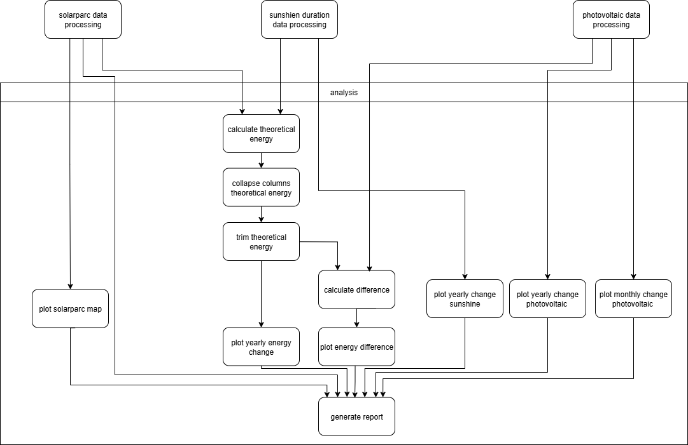

<!-- _paginate: skip -->
# Germany’s Solar Potential Theory vs. Reality

---

##### Research Questions

1. To what extent can theoretical solar energy production be estimated?

2. How does the theoretical energy production compare to the actual energy production?

...

---

##### Modules

---

##### Non functional requirements

**Compatibility**: The workflow must run on Windows Mac OS and Linux.
**Documentation**: The documentation is for users and developers.
**Reproducibility**: The workflow must be reproducible.
**Testability**: The code must be well tested.

---

##### Workflow: Part 1

---

##### Workflow: Part 2

---

##### Dataset

| Dataset              | Origin           | Data format | API         | Link                | Licence                      |
| -------------------- | ---------------- | ----------- | ----------- | ------------------- | ---------------------------- |
| Solarparcs & Germany | Open Street Maps | OSM XML     | OverpassAPI | openstreetmap.org   | © OpenStreetMap contributors |
| Sunshine Duration    | DWD              | TXT         | -           | opendata.dwd.de     | CC-BY-4.0                    |
| Actual Energy        | DESTATIS         | CSV or XML  | -           | genesis.destatis.de | Data Licence Germany 2.0     |

---

#### Created Tools

| **Stage**                 | **Tool**              |
| ------------------------- | ----------------------- |
| **Data Acquisition**      | wgetdir.py              |
| **Data Processing**       | clip.py                 |
|                           | merge_series.py         |
|                           | clean_pv_data.py        |
|                           | polygons2area.py        |
|                           | collapse_columns.py     |
|                           | trim.py                 |
|                           | calculate_energy.py     |
|                           | calculate_difference.py   |
| **Data Visualization**    | plot_geo.py             |
|                           | plot_yearly_change.py   |
|                           | plot_monthly_change.py  |
|                           | plot_difference.py |

---

<!-- Flo  -->

##### Results - Solarparcs Area

- Total area: 16.000 $km^2$

---

##### Results - Sunshine Duration

---

##### Results - Theoretical Energy

---

##### Results - Actual Energy

---

##### Results - Difference

---

##### Reflection

###### Worked well

- Working with workflows (Snakemake)
- Working with Issues and Tasks as a group
- Review process
- Access to relevant data

###### Challenges

- Defining clear roadmap
- Group communication
- Working with licences

---

##### Not included

- Analysis of monthly change

---

##### Thank you for you attention.

Why do you think the theorical and actual energy diverges more in earlier year?
